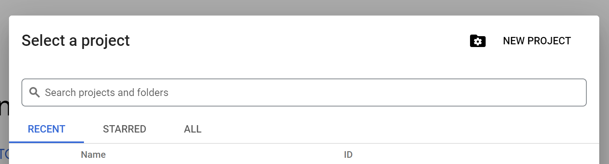
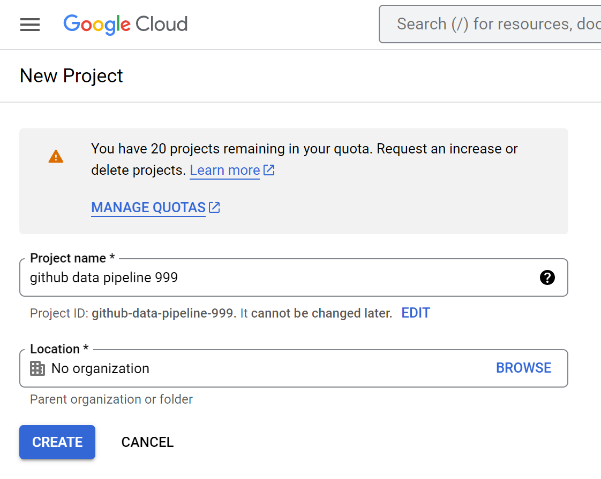
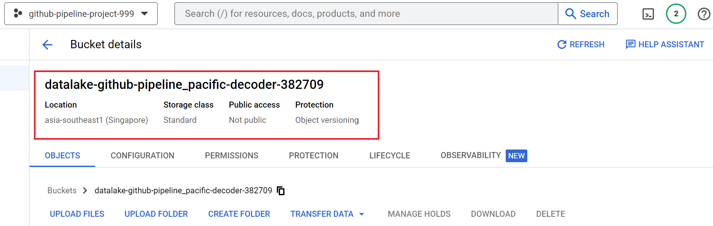
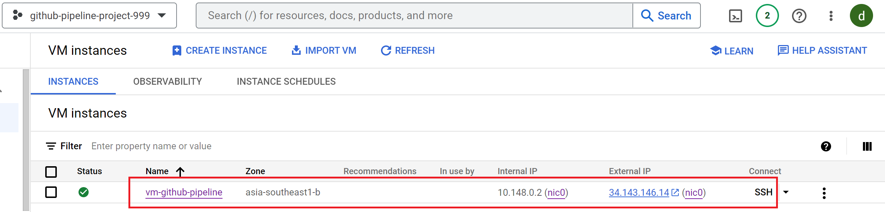
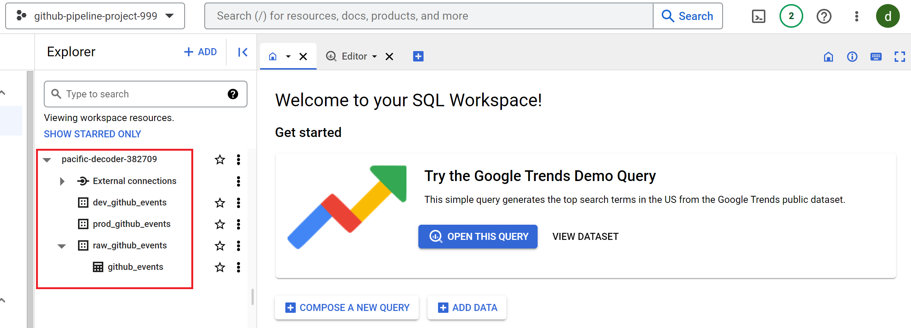
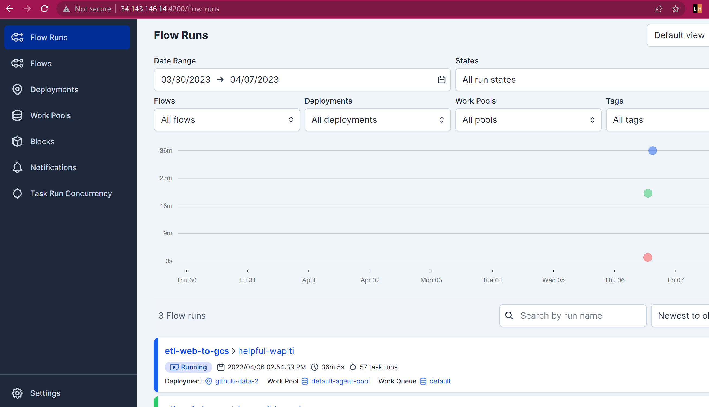
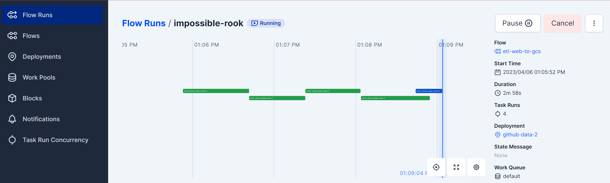
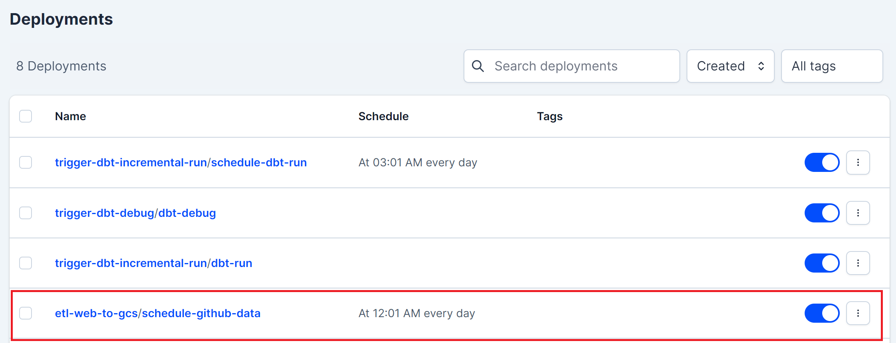
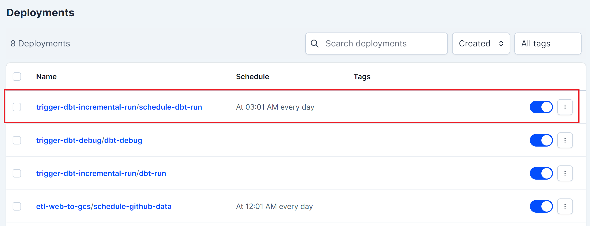

# End-to-End Github Events Data Pipeline

## Table of Contents

- [Problem Description](#problem-description)
- [Technologies](#technologies)
- [Data Pipeline Architecture and Workflow](#data-pipeline-architecture-and-workflow)
    - [(1) Ingest historical and (5) moving-forward data to Google Cloud Storage](#1-ingest-historical-and-5-moving-forward-data-to-google-cloud-storage)
    - [(2) BigQuery loads data from Cloud Storage](#2-bigquery-loads-data-from-cloud-storage)
    - [(3) Data Warehouse Transformation with dbt and (6) prefect to schedule incremental transformation](#3-data-warehouse-transformation-with-dbt-and-6-prefect-to-schedule-incremental-transformation)
    - [(4) Data Visualization with Looker](#4-data-visualization-with-looker)
- [Reproducability](#reproducability)
    - [Step 1: Build GCP Resources from Local Computer](#step-1-build-gcp-resources-from-local-computer)
    - [Step 2: Setup Workaround on VM](#step-2-setup-workaround-on-vm)
- [Further Improvements](#further-improvements)


## Problem Description

This project showcases the best practices from [Data Engineering Zoomcamp](https://github.com/DataTalksClub/data-engineering-zoomcamp) course. I aim to build an end-to-end batch data pipeline and analyze Github user activities from the beginning of this year.

You must have known about Github. GitHub is where people build software. More than 100 million people use GitHub to discover, fork, and contribute to over 330 million projects. 

It is very interesting that Github user activities are publicly available [here](https://www.gharchive.org/). The dataset are grouped on hourly basis and stored in a JSON format. Each user activity is labeled with event type, such as: `push`, `pull-request`, `issues`, `commit`, etc. There are >150K rows of activities recorded in each dataset. In average, the size of the daily data is around 1,4GB and this dataset is updated daily.

In this project, I am going to implement some data engineering best practices and gain interesting metrics, such as:  
- daily most active users (count by number of push)
- daily most active repos (count by number of PR)
- daily most active organizations (count by number of PR)
- daily number of event based on its type

## Technologies

This project utilizes such following tools that I learned from Data Engineering zoomcamp. 

- Google Cloud Storage as the datalake to store our raw dataset.
- Google BigQuery as the data warehouse.
- dbt core as the transformation tool to implement data modeling.
- Self-hosted Prefect core to manage and monitor our workflow.
- Terraform to easily manage the infrastructure setup and changes.
- Google Compute Engine as the virtual host to host our data pipeline.
- Looker as the dashboard for end-user to create report and visualize some insights,

with some improvements to support easy reproducability, such as: 
- Makefile 
- Containerized environment with docker

## Data Pipeline Architecture and Workflow


The workflow is as follows: 

### (1) Ingest historical and (5) moving-forward data to Google Cloud Storage

The system ingests data from [gharchive](https://www.gharchive.org/). Historical data covers the data that are created before the ingestion date. Moving-forward data is data that are updated daily. 

Prefect is used to run both types of data and to schedule daily ingestion for moving-forward data.

Google Cloud Storage is our datalake. The data is stored in the datalase as Parquet files, partitioned by Year, Month and Day.


### (2) BigQuery loads data from Cloud Storage 

Google BigQuery serves as the data warehouse for the project. I implement several data modeling layers in BigQuery. The first layer of my data warehouse is the raw layer.

The raw layer is the layer where BigQuery uses external table to load our data from the datalake. Raw layer can contain any data duplications that may happens during the ingestion process (for example: through backfilling)

The external table configurations are defined in [the terraform script](./infra/gcp/bigquery.tf).


### (3) Data Warehouse Transformation with dbt and (6) prefect to schedule incremental transformation

BigQuery along with [dbt](https://docs.getdbt.com/) is implemented to utilize data modeling layers. 

As previously explained, the first layer of my data warehouse is raw layer; and the second layer is the staging layer. Staging layer ensures the data idempotency by removing data duplicate. The last layer is the core layer that do cleaning data (removal any events that are generated by bot) and the do metrics aggregation process.

Prefect is used to run ad-hoc `dbt` data transformation and to schedule daily data transformation for moving-forward data.

### (4) Data Visualization with Looker


[The link to the dashboard](https://lookerstudio.google.com/reporting/f4b3fe85-67f5-425a-8396-d9b8a625ab7b)


## Reproducability
**Pre-requisites**: I use [Makefile](./Makefile) to make ease the reproducability process. Please install `make` tool in the Ubuntu terminal with this command `sudo apt install make -y`.

### Step 1: Build GCP Resources from Local Terminal

1. Clone this (repository)[https://github.com/oktavianidewi/github-data-pipeline.git] to your local workspace.

2. Open [google cloud console](https://console.cloud.google.com/) and create a new GCP project by clicking `New Project` button.



You will be redirected to a new form, please provide the project information detail, copy the `project_id` and click `Create` button.



3. Let's create some resources (BigQuery, Cloud Engine and Cloud Storage and Service Account) on top of the newly created project using terraform. You should provide some information such as: `project_id`, `region` and `zone` in [infra/gcp/terraform.tfvars](./infra/gcp/terraform.tfvars) as per your GCP setting.

4. Once you've updated the file, run this command to spin-up the infrastructure resource up.

    ```
    make infra-init-vm
    ```

    If there is an error saying that the call to enable services (`compute`, `cloud_resource`) is failing, please re-run the command again.

5. Go to google console dashboard and make sure that all of the resources are built succesfully. 
    - [IAM and Service Account](https://console.cloud.google.com/iam-admin)
    
    

    - [Cloud Storage](https://console.cloud.google.com/storage/browser)
    

    - [Compute Engine](https://console.cloud.google.com/compute/instances)
    

    - [BigQuery](https://console.cloud.google.com/bigquery)
    

    - `/ssh` folder contains ssh-key to access newly created Compute Engine. Copy this file to your `home/.ssh` directory
    ```
    cp ssh/github-pipeline-project ~/.ssh/
    ```
6. Download the service-account keyfile (previously created via terraform) to a file named `sa-github-pipeline-project.json` with this command

    ```
    make generate-sa
    ```

### Step 2: Setup Workaround on VM Terminal

7. Connect to GCE using SSH

    ```
    ssh -i ~/.ssh/github-pipeline-project <your-email-address-for-gcp>@<external-vm-ip>
    ```

8. Once you've got succesfully connected to the VM. Clone [this repository](https://github.com/oktavianidewi/github-data-pipeline.git), install `make` tool and terraform inside the VM.

    ```
    git clone https://github.com/oktavianidewi/github-data-pipeline.git

    sudo apt install make -y

    make install-terraform
    ```

9. Let's go back to the **local terminal**. Upload your service-account keyfile to VM directory with this command:

    ```
    make copy-service-account-to-vm
    ```

10. In VM terminal, run initial setup for VM with `make` command, that will install `docker`, `docker-compose`, `pip` and `jq` tools.
    ```
    make initial-setup-vm
    ```

11. Change some variables in [.env](.env) file and supply it with your GCP account information

    ```
    # CHANGE-THIS
    GCP_PROJECT_ID="pacific-decoder-382709"

    # CHANGE-THIS
    GCS_BUCKET="datalake-github-pipeline"

    # CHANGE-THIS
    GCP_ZONE="asia-southeast1-b"

    # CHANGE-THIS
    GCS_BUCKET_ID="datalake-github-pipeline_pacific-decoder-382709"

    # CHANGE-THIS
    GCS_PATH="gs://datalake-github-pipeline_pacific-decoder-382709"

    # CHANGE-THIS
    GCP_EMAIL_WITHOUT_DOMAIN_NAME="learndewi"
    ```

    Change some variables in [infra/gcp/terraform.tfvars](./infra/gcp/terraform.tfvars) and supply it with your GCP setting information

    ```
    project_id = "pacific-decoder-382709" # CHANGE-THIS
    region     = "asia-southeast1"        # CHANGE-THIS
    zone       = "asia-southeast1-b"      # CHANGE-THIS
    ```


12. Run prefect server and agent in VM with this command
    ```
    export PREFECT_ORION_UI_API_URL=http://<external-vm-ip>:4200/api 

    make docker-spin-up

    ```
13. Go to your browser and paste `http://<external-vm-ip>:4200` on URL bar to open prefect dashboard. Now your prefect core is up!

    

14. Start historical data ingestion to cloud storage with this command
    ```
    make block-create
    make ingest-data
    ```
    This command will create a prefect flow deployment to: 
    - read data from github events
    - chunk data into a certain rows
    - type cast data as needed
    - store data into cloud storage partitioned by its `year`, `month` and `day`.

    

15. To ingest moving-forward data run this command: 
    ```
    make set-daily-ingest-data
    ```
    This command will schedule a deployment in prefect to run daily ingestion data at 00.01.

    

16. Once all the raw data are stored in the datalake, we can start transforming the raw data into our data warehouse with dbt. Run this command to transform data to `dev` environment.

    ```
    make transform-data-dev
    ```

17. To transform data to a production environment, run this command
    ```
    make transform-data-prod
    ```

18. To set daily transformation data to the production environment, run this command:
    ```
    make set-daily-transform-data-prod
    ```
    This command will schedule a deployment in prefect to run daily dbt transformation data at 03.01.

    


## Further Improvements
There are many things can be improved from this project: 
- Implement CI/CD
- Do a comprehensive testing
