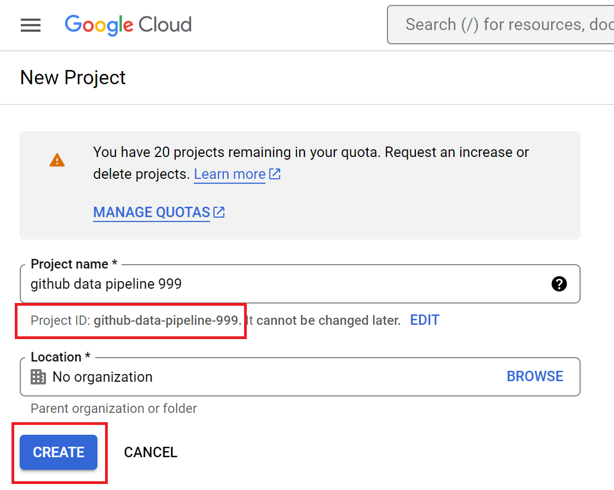

# End-to-End Github Events Data Pipeline

## Table of Contents

- [Problem Description](#problem-description)
- [Tech Stack](#tech-stack)
- [Data Pipeline Architecture and Workflow](#data-pipeline-architecture-and-workflow)
- [Dashboard Preview](#dashboard-preview)
- [Reproducability](#reproducability)
    - [Step 1: Build GCP Resources from Local Computer](#step-1-build-gcp-resources-from-local-computer)
    - [Step 2: Setup Workaround on VM](#step-2-setup-workaround-on-vm)
- [Further Improvements](#further-improvements)


## Problem Description

This project showcases the best practices from [Data Engineering Zoomcamp](https://github.com/DataTalksClub/data-engineering-zoomcamp) course. I aim to build an end-to-end batch data pipeline and analyze Github user activities from the beginning of this year.

You must have known about Github. GitHub is where people build software. More than 100 million people use GitHub to discover, fork, and contribute to over 330 million projects. 

It is very interesting that Github user activities are publicly available [here](https://www.gharchive.org/). The dataset are grouped on hourly basis and stored in a JSON format. Each user activity is labeled with event type, such as: `push`, `pull-request`, `issues`, `commit`, etc. There are >150K rows of activities recorded in each dataset. In average, the size of the daily data is around 1,4GB and this dataset is updated daily.

In this project, I am going to implement some data engineering best practices and gain interesting metrics, such as:  
- daily most issue created from repository
- daily most forked repository
- daily most active users (count by number of push)
- daily most active repos (count by number of PR)
- daily most active organizations (count by number of PR)
- daily heatmap graph showing active hour 
- daily number of event based on its type

## Tech Stack

This project utilizes such following tools that I learned from Data Engineering zoomcamp. 

- Google Cloud Storage as the datalake to store our raw dataset.
- Google BigQuery as the data warehouse.
- dbt core as the transformation tool to implement data modeling.
- Prefect to manage and monitor our workflow.
- Terraform to easily manage the infrastructure setup and changes.
- Google Compute Engine as the virtual host to host our data pipeline.
- Looker as the dashboard for end-user to create report and visualize some insights,

with some improvements to support easy reproducability, such as: 
- Makefile 
- Containerized environment with docker

## Data Pipeline Architecture and Workflow


The workflow is as follows: 

### Data Ingestion

- Ingest historical-data and moving-forward data with prefect

- Dataset schema

```
events: 
- "PushEvent"
- "CreateEvent"
- "PullRequestEvent"
- "ForkEvent"
- "IssuesEvent"
- "WatchEvent"
- "IssueCommentEvent"
- "DeleteEvent"
- "CommitCommentEvent"
- "ReleaseEvent"
- "PullRequestReviewEvent"
- "MemberEvent"
- "PullRequestReviewCommentEvent"
- "PublicEvent"
- "GollumEvent"
```
- Chunking data
- Partition by the date
- External load table from BigQuery

### Data Transformation
- ensure idempotency of data in staging layer
- Query optimizing with partitioning and bucketing
- Utilize dbt incremental model
- Implement data model best practices in core layer
- Scheduling transformation workflow with prefect

### Data Visualization
- sadasdsdsa

### Data Infrastructure
- Dockerize prefect in VM and setting port 
- Terraform to manage cloud resource

## Dashboard Preview

## Reproducability
**Pre-requisites**: I use [Makefile](./Makefile) to make ease the reproducability process. Please install `make` tool in the Ubuntu terminal with this command `sudo apt install make -y`.

### Step 1: Build GCP Resources from Local Computer

1. Clone this (repository)[https://github.com/oktavianidewi/github-data-pipeline.git] to your local workspace.

2. Open [google cloud console](https://console.cloud.google.com/) and create a new GCP project by clicking `New Project` button.


You will be redirected to a new form, please provide the project information detail, copy the `project_id` and click `Create` button.



3. Let's create some resources (BigQuery, Cloud Engine and Cloud Storage and Service Account) on top of the newly created project using terraform. You should provide some information such as: `project_id`, `region` and `zone` in [infra/gcp/terraform.tfvars](./infra/gcp/terraform.tfvars) as per your GCP setting.

4. Once you've updated the file, run this command to spin-up the infrastructure resource up.

```
make infra-init-vm
make block-create
```

If there is an error like this happens: 
```
```
Please re-run the command again.

5. Go to google console dashboard and make sure that all of the resources are built succesfully. 
- [IAM and Service Account](https://console.cloud.google.com/iam-admin)


- [Cloud Storage](https://console.cloud.google.com/storage/browser)


- [Compute Engine](https://console.cloud.google.com/compute/instances)


- [BigQuery](https://console.cloud.google.com/bigquery)


- `/ssh` folder contains ssh-key to access newly created Compute Engine. Copy this file to your `home/.ssh` directory
```
cp ssh/github-pipeline-project ~/.ssh/
```

### Step 2: Setup Workaround on VM

5. Connect to GCE using SSH

```
ssh -i ~/.ssh/github-pipeline-project <your-email-address-for-gcp>@<external-vm-ip>
```

6. Once you've got succesfully connected to the VM. Clone [this repository](https://github.com/oktavianidewi/github-data-pipeline.git), install `make` tool and terraform inside the VM.

```
git clone https://github.com/oktavianidewi/github-data-pipeline.git

sudo apt install make -y

make install-terraform
```

8. Run initial setup for vm with `make` command, that will install `docker`, `docker-compose`, `pip` and `jq` tools.
```
make initial-setup-vm
```

9. Run prefect server and agent in VM with this command
```
export PREFECT_ORION_UI_API_URL=http://<external-vm-ip>:4200/api 

make docker-spin-up

```
10. Go to your browser and paste `http://<external-vm-ip>:4200` on URL bar to open prefect dashboard.


11. Start historical data ingestion to cloud storage with this command
```
make ingest-data
```
This command will create a prefect flow deployment to: 
- read data from github events
- chunk data into a certain rows
- type cast data as needed
- store data into cloud storage partitioned by its `year`, `month` and `day`.

12. To ingest moving-forward data run this command: 
```
make set-daily-ingest-data
```
This command will schedule a deployment in prefect to run daily ingestion data at 00.01.

13. Once all the raw data are stored in the datalake, we can start transforming the raw data into our data warehouse with dbt. Run this command to transform data to `dev` environment.

```
make transform-data-dev
```

14. To transform data to a production environment, run this command
```
make transform-data-prod
```

15. To set daily transformation data to the production environment, run this command:
```
make set-daily-transform-data-prod
```

## Further Improvements
There are many things can be improved: 
- Use CI/CD
- Implement testing
