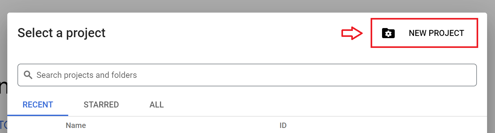

## Problem Description

This project showcases the best practice on what I've been learning from Data Engineering Zoomcamp course. I aim to build an end-to-end batch data pipeline to analyze Github user activities from the beginning of this year.

You must have known about Github. GitHub is where people build software. More than 100 million people use GitHub to discover, fork, and contribute to over 330 million projects. 

It is very interesting that Github user activities are publicly available [here](https://www.gharchive.org/). The dataset are grouped on hourly basis and stored in a JSON format. Each user activity is labeled with event type, such as: `push`, `pull-request`, `issues`, `commit`, etc. There are >150K rows of activities recorded in each dataset. In average, the size of the daily data is around 1,4GB and this dataset is updated daily.

In this project, I am going to implement some data engineering best practices and gain interesting metrics, such as:  
- daily most issue created from repository
- daily most forked repository
- daily most active users (count by number of push)
- daily most active repos (count by number of PR)
- daily most active organizations (count by number of PR)
- daily heatmap graph showing active hour 
- daily number of event based on its type

## Tools

This project utilizes such following tools that I learned from Data Engineering zoomcamp. 

- Google Cloud Storage as the data-lake to store our raw dataset.
- Google BigQuery as the data warehouse.
- dbt core as the transformation tool to implement data modeling.
- Prefect to manage and monitor our workflow.
- Terraform to easily manage the infrastructure setup and changes.
- Google Compute Engine as the virtual host to host our data pipeline.
- Looker as the dashboard for end-user to create report and visualize some insights,

with some improvements to support easy reproducability, such as: 
- Makefile 
- Containerized environment with docker

## Data Pipeline Architecture and Workflow


The workflow is as follows: 

### Data Ingestion

- historical-data and moving-forward data with prefect
- Dataset schema

```
events: 
- "PushEvent"
- "CreateEvent"
- "PullRequestEvent"
- "ForkEvent"
- "IssuesEvent"
- "WatchEvent"
- "IssueCommentEvent"
- "DeleteEvent"
- "CommitCommentEvent"
- "ReleaseEvent"
- "PullRequestReviewEvent"
- "MemberEvent"
- "PullRequestReviewCommentEvent"
- "PublicEvent"
- "GollumEvent"
```
- Chunking data
- Partition by the date
- External load table from BigQuery

### Data Transformation
- ensure idempotency of data in staging layer
- Query optimizing with partitioning and bucketing
- Utilize dbt incremental model
- Implement data model best practices in core layer
- Scheduling transformation workflow with prefect

### Data Visualization
- sadasdsdsa

### Data Infrastructure
- Dockerize prefect in VM and setting port 
- Terraform to manage cloud resource

## Dashboard Preview

## Reproducability
**Pre-requisites**: I use [Makefile](./Makefile) to make ease the reproducability process. Please install `make` tool in the Ubuntu terminal with this command `sudo apt install make -y`.


1. Open [google cloud console](https://console.cloud.google.com/) and create a new GCP project by clicking `New Project` button.



You will be redirected to a new form, please provide the project information detail, copy the `project_id` and click `Create` button.


2. Let's create some resources (BigQuery, Cloud Engine and Cloud Storage and Service Account) on top of the newly created project using terraform. You should provide some information such as: `project_id`, `region` and `zone` in [infra/gcp/terraform.tfvars](./infra/gcp/terraform.tfvars) as per your GCP setting.

3. Once you've updated the file, run this command to spin-up the infrastructure resource up.

```
make infra-init-vm:
```

If there is an error like this happens: 
```
```
Please re-run the command again.

4. Run this command to create new VM and generate service-account with terraform

```
make xxx
```

5. Open Google Cloud Engine, copy IP ssh to home directory.

6. Insert to GCE using SSH

7. Clone repository, install make, install initial setup using make

8. Run make command 


## Improvements

There are many things can be improved